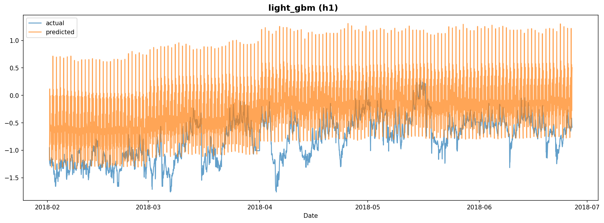

# Experiment Report: exp_001

**Dataset**: h1
**Generated**: 2026-02-06 17:37:41

---

## Model Results

### SARIMA

#### Model Configuration

- **Order (p, d, q)**: (0, 1, 1)
- **Seasonal Order (P, D, Q, m)**: (1, 0, 0, 24)
- **AIC**: -22466.0070
- **BIC**: -22443.3810
- **Model Path**: `/home/yteramoto/dev/github/YHTR0257/athena-assignment/models/exp_001/sarima_h1.pkl`

#### Evaluation Metrics

| Metric | Value |
|--------|-------|
| MAPE | 190.7146 |
| RMSE | 0.5091 |
| R2 | -0.7233 |

#### Prediction Plot

---

### LightGBM

#### Model Configuration

- **Number of Trees**: 36
- **Model Path**: `/home/yteramoto/dev/github/YHTR0257/athena-assignment/models/exp_001/light_gbm_h1.txt`

#### Evaluation Metrics

| Metric | Value |
|--------|-------|
| mape | 125.5426 |
| rmse | 0.7661 |
| mae | 0.6177 |
| r2 | -2.9028 |

#### Prediction Plot

---
