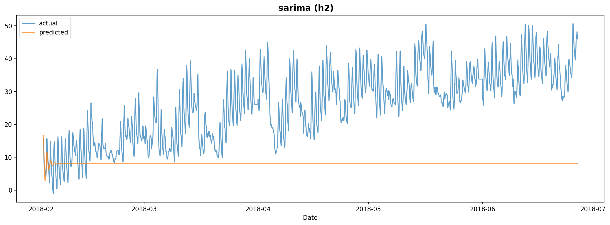
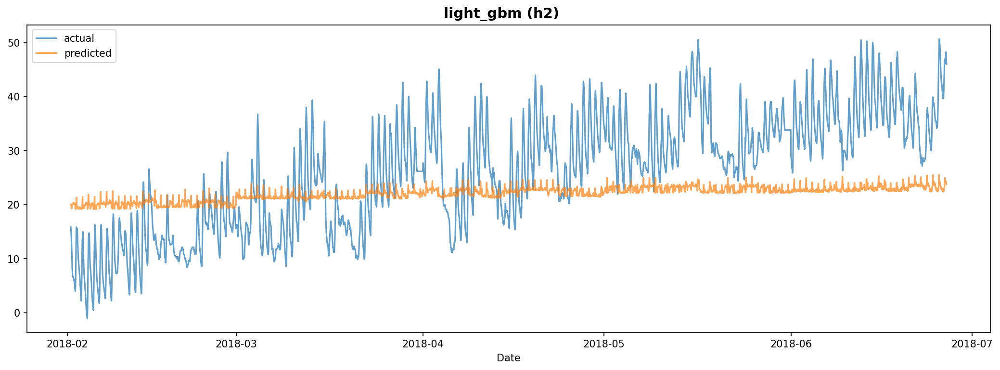

# Experiment Report: exp_001

**Dataset**: h2
**Generated**: 2026-02-06 17:37:44

---

## Model Results

### SARIMA

#### Model Configuration

- **Order (p, d, q)**: (2, 1, 2)
- **Seasonal Order (P, D, Q, m)**: (1, 0, 0, 24)
- **AIC**: 36180.7034
- **BIC**: 36225.9555
- **Model Path**: `/home/yteramoto/dev/github/YHTR0257/athena-assignment/models/exp_001/sarima_h2.pkl`

#### Evaluation Metrics

| Metric | Value |
|--------|-------|
| MAPE | 89.9746 |
| RMSE | 20.9495 |
| R2 | -2.8358 |

#### Prediction Plot

---

### LightGBM

#### Model Configuration

- **Number of Trees**: 85
- **Model Path**: `/home/yteramoto/dev/github/YHTR0257/athena-assignment/models/exp_001/light_gbm_h2.txt`

#### Evaluation Metrics

| Metric | Value |
|--------|-------|
| mape | 114.7487 |
| rmse | 10.6358 |
| mae | 9.0449 |
| r2 | 0.0113 |

#### Prediction Plot

---
