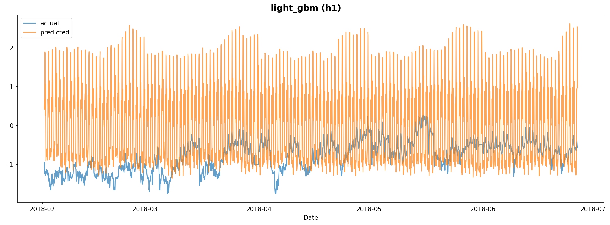

# Experiment Report: exp_002

**Dataset**: h1
**Generated**: 2026-02-07 18:32:36

---

## Model Results

### LightGBM

#### Model Configuration

- **Number of Trees**: 435
- **Model Path**: `/home/yteramoto/dev/github/YHTR0257/athena-assignment/models/exp_002/light_gbm_h1.txt`

#### Evaluation Metrics

| Metric | Value |
|--------|-------|
| mape | 221.7216 |
| rmse | 1.1994 |
| mae | 0.8959 |
| r2 | -8.5658 |

#### Prediction Plot

---
