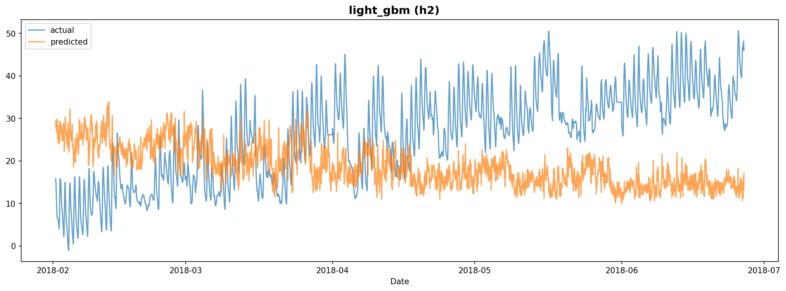

# Experiment Report: exp_002

**Dataset**: h2
**Generated**: 2026-02-07 18:34:54

---

## Model Results

### LightGBM

#### Model Configuration

- **Number of Trees**: 172
- **Best Parameters (Optuna)**:
  - learning_rate: 0.298802
  - num_leaves: 188
  - bagging_fraction: 0.788655
  - min_child_samples: 94
  - bagging_freq: 10
  - feature_fraction: 0.740847
- **Optuna Best RMSE**: 5.9160
- **Model Path**: `/home/yteramoto/dev/github/YHTR0257/athena-assignment/models/exp_002/light_gbm_h2.txt`

#### Evaluation Metrics

| Metric | Value |
|--------|-------|
| mape | 151.5021 |
| rmse | 15.8711 |
| mae | 13.7053 |
| r2 | -1.2015 |

#### Prediction Plot

---
