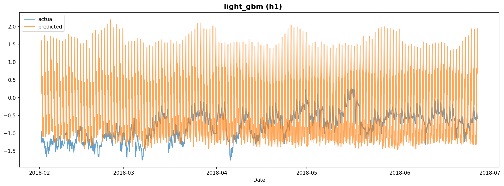

# Experiment Report: exp_003

**Dataset**: h1
**Generated**: 2026-02-07 19:35:33

---

## Model Results

### LightGBM

#### Model Configuration

- **Number of Trees**: 289
- **Best Parameters (Optuna)**:
  - learning_rate: 0.230624
  - num_leaves: 125
  - bagging_fraction: 0.549991
  - min_child_samples: 83
  - bagging_freq: 3
  - feature_fraction: 0.998346
- **Optuna Best RMSE**: 0.5742
- **Model Path**: `/home/yteramoto/dev/github/YHTR0257/athena-assignment/models/exp_003/light_gbm_h1.txt`

#### Evaluation Metrics

| Metric | Value |
|--------|-------|
| mape | 208.7268 |
| rmse | 1.0673 |
| mae | 0.8408 |
| r2 | -6.5748 |

#### Prediction Plot

---
