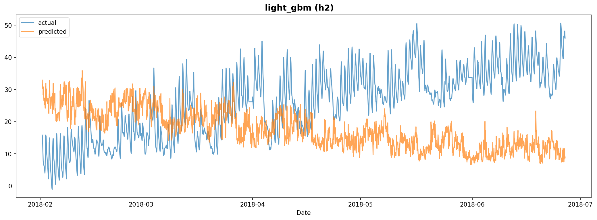

# Experiment Report: exp_003

**Dataset**: h2
**Generated**: 2026-02-07 20:48:03

---

## Model Results

### LightGBM

#### Model Configuration

- **Number of Trees**: 144
- **Best Parameters (Optuna)**:
  - learning_rate: 0.240451
  - num_leaves: 175
  - bagging_fraction: 0.567028
  - min_child_samples: 69
  - bagging_freq: 8
  - feature_fraction: 0.836745
- **Optuna Best RMSE**: 6.4327
- **Model Path**: `/home/yteramoto/dev/github/YHTR0257/athena-assignment/models/exp_003/light_gbm_h2.txt`

#### Evaluation Metrics

| Metric | Value |
|--------|-------|
| mape | 164.0660 |
| rmse | 17.6213 |
| mae | 15.1404 |
| r2 | -1.7138 |

#### Prediction Plot

---
