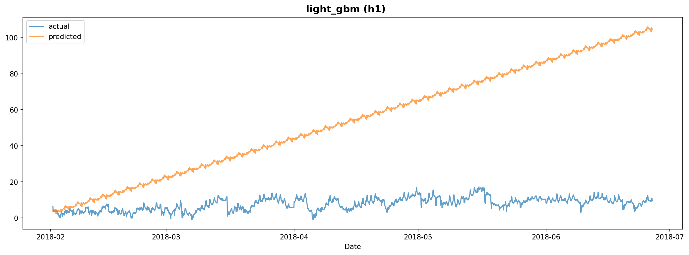

# Experiment Report: exp_test

**Dataset**: h1
**Generated**: 2026-02-08 11:53:02

---

## Model Results

### LightGBM

#### Model Configuration

- **Number of Trees**: 70
- **Model Path**: `/home/yteramoto/dev/github/YHTR0257/athena-assignment/models/exp_test/light_gbm_h1.txt`

#### Evaluation Metrics

| Metric | Value |
|--------|-------|
| mape | 16704.4627 |
| rmse | 62.2018 |
| mae | 54.9075 |
| r2 | -25728.6066 |

#### Prediction Plot

---
