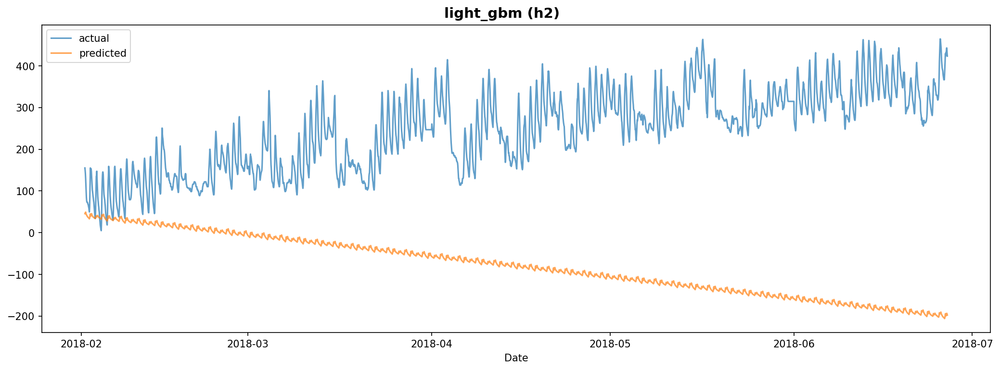

# Experiment Report: exp_test

**Dataset**: h2
**Generated**: 2026-02-08 12:07:04

---

## Model Results

### LightGBM

#### Model Configuration

- **Number of Trees**: 6
- **Best Parameters (Optuna)**:
  - learning_rate: 0.098020
  - num_leaves: 163
  - bagging_fraction: 0.672393
  - min_child_samples: 69
  - bagging_freq: 7
  - feature_fraction: 0.998842
- **Optuna Best RMSE**: 2.3035
- **Model Path**: `/home/yteramoto/dev/github/YHTR0257/athena-assignment/models/exp_test/light_gbm_h2.txt`

#### Evaluation Metrics

| Metric | Value |
|--------|-------|
| mape | 502.0388 |
| rmse | 131.6855 |
| mae | 109.5867 |
| r2 | -150.5598 |

#### Prediction Plot

---
